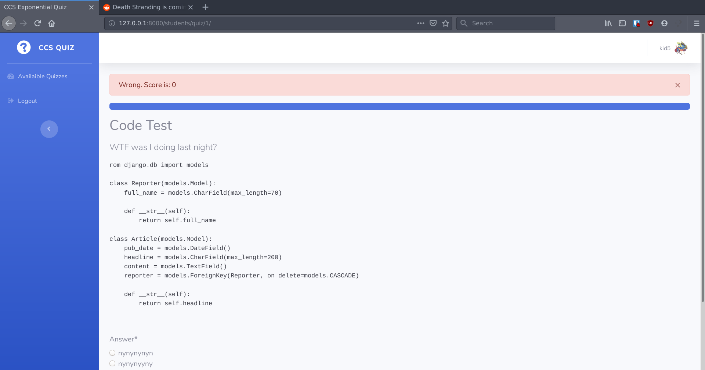
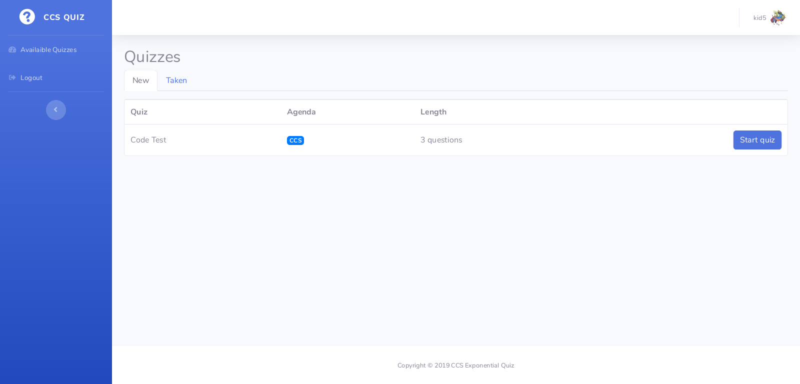
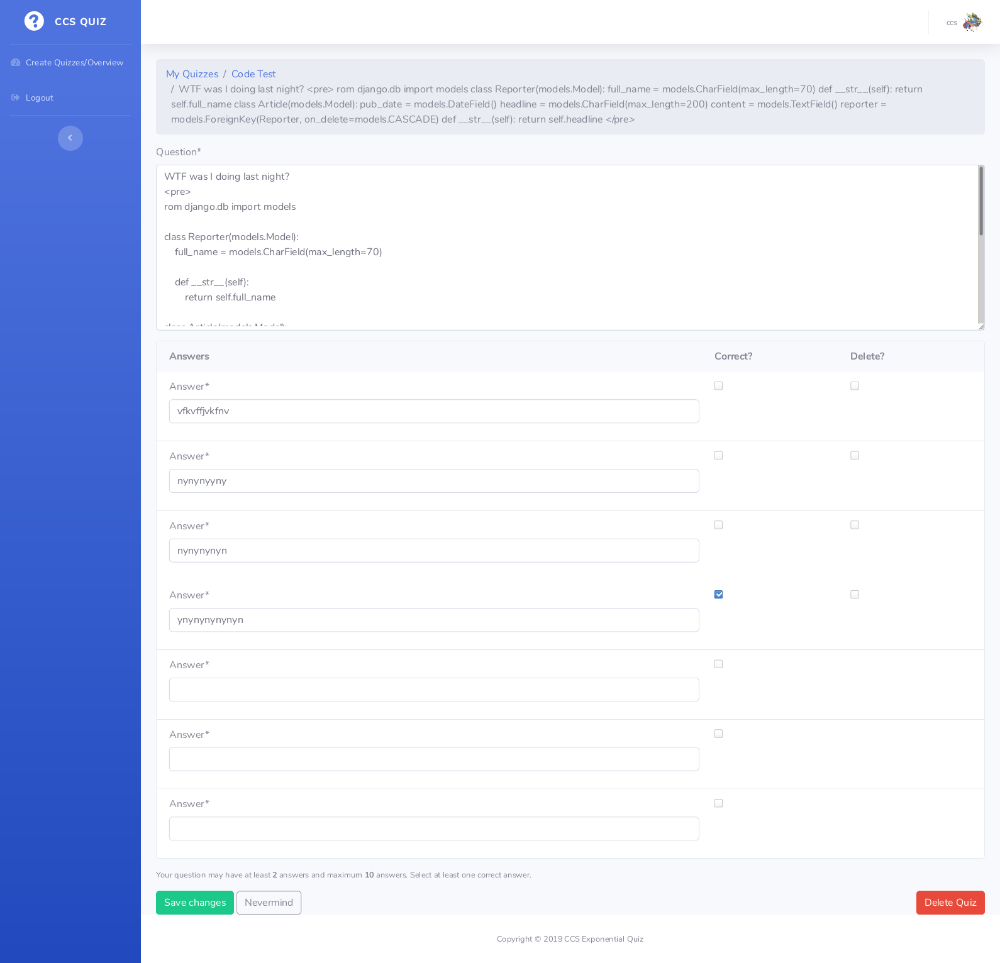

# Exponential Quiz
Online quiz app with exponential scoring. Built for a CCS-TIET event.



## Features

* Standard Quiz Features
* Exponential Scoring and negative marking
* Know your score after each answer submission
* User auth for both quiz makers and students
* Images/Code/Text in questions.
* Anti cheat (Note: The Anti Cheat features give false positives on Firefox so please use other browsers for the test or disable anti-cheat.)

## Score System

* Questions will appear one by one.
* The participant will have the choice of either skipping the question or answering it.
* If they answer it corectly they'll get 2^1 points.
* If they answer another question correctly after that theyll get 2^2 points.
* And so on 
* If they skip a question, next questions points will again start from 2^1.
* If they answer the question incorrectly 2 marks will be deducted.
* If they answer another question incorrectly 4 marks will be deducted and so on.


## Running Locally

Install the requirements:

In a python3virtualenv,
```bash
pip install -r requirements.txt
``


Link to the database by setting the DATABASE_URL environment variable. Then run:

```bash
python manage.py migrate
```

Finally, run the development server:

```bash
python manage.py runserver
```


## Notes
* The contents of one option of a question should be 'Skip' if you want a question to be skippable.
* Basic html markup can be inserted into the questions for code, images, formatting, etc.

## Other Screenshots





